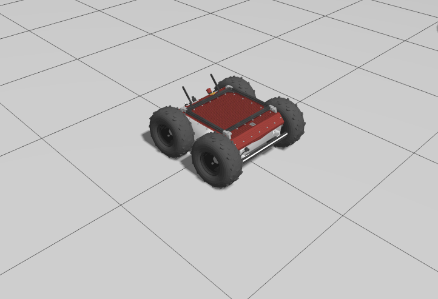
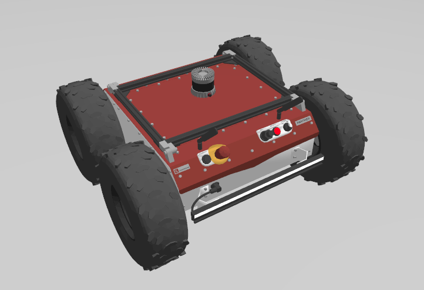
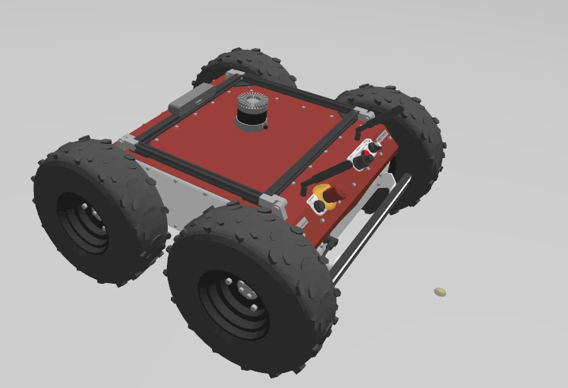

# Panther Robots

This workspcae contains the customised panther robot models which can be spawned in to the gazebo enviornment.

*The spawn location of the robots is hardocded*


<br>
<hr>


##  There are 2 custom modesls of the Panther Robot which were used in the Project

1. Panther - 1 (Ouster Lidar)
2. Panther - 2 (Ouster Lidar + Zed Depth Camera)

The base configuration of both the Models are the default ones which are provided by the [`Hussarain Panther Github`](https://github.com/husarion/panther_ros/tree/ros2-devel). 

*Please make sure you are using the branch state in the link above, as newere ROS2 branch has some breaking changes to the panther description.*


<div style="text-align: center;">
    
</div>

TO be able to get the base configuration of the panther you can use the following command to spawn the panther in the gazebo enviornment.

```bash
ros2 launch panther_gazebo simulation.launch.py
```

<br>

The `Hussarain Panther Github` has also provided the additional urdf files for adding the sensors to the robot. But due to some issues in the gazebo version (Differernce between the Gazebo classic and Igniton Gazebo sensor plugins), default some default urdfs were not working. So we had to modify the corresponding plugin to the ignition gazebo specific styles (Since ignition gazebo is still in development some features are not yet implemented by the gazebo dev team and hence the corresponding issues cannot be fixed)

<br>
<hr>

One of the major issue is to get the snesor msg to have the frame Id which corresponds to the frame ID in the TF tree generated in ROS.

Since Gzebo collapses the fixed joints to one blob and defines custom names to it, the default frame ID for corresponding sensor topic braodcasted will match the collapsed framed IDs (Gazebo uses custom names for it). There is option in each sensor plugin to define tags which set the frame ID to a particular topic, but for some reason these tags wehre not working, had to do a lot of fiddling to get these tags to work, and set the appropriate frame ID.

One workaroud for not being able to set hte frame ID through Gazebo is to create custom Tranform nodes which add the static transform between the sensor Frame ID reported by gazebo and the existing closest frame ID in the ROS TF tree.

<br>
<hr>

### Why is frame ID of the sensor message topic Important?
Well, all ROS packages including RVIZ uses these frames ID to determine the transforms for the data for calcuation and visualization. If the frame ID doesnot correspond to the TF, these messages are ignored with some standard error message.


<br>
<hr>


# 1. Panther - 1 (LIDAR)

This package contains the panther with the ouster Lidar attached to the frames on the top. 

<div style="text-align: center;">
    
</div>

<br>
<br>
<br>
<!-- thick border HR -->
<hr style="border: 2px solid gray;">

# 2. Panther - 2 (LIDAR + Depth Camera)

This package contains the panther with the ouster Lidar attached to the frames on the top. 

<div style="text-align: center;">
    
</div>


<br>
<br>
<br>
<!-- thick border HR -->
<hr style="border: 2px solid gray;">


# 3. Panther - 3 (UWB Tag)

This package contains the default panther with the UWB Tag attached to the cover Link. Also the package contains the necessary launch files to spawn the robot in the gazebo enviornment. Along with any transforms for topics and visualization message.

The custom panther has the `Ground Truth Publisher` plugin addde to get the ground truth of the pather from the gazebo, it has certain nodes to help in this process. For more details read the package readme file, the section about the `Ground Truth Publisher` plugin. 


<br>
<br>
<br>
<!-- thick border HR -->
<hr style="border: 2px solid gray;">


# 4. Panther - 4 (LIDAR + UWB Tag)

This package contains the panther with the ouster Lidar attached to the frames on the top. Along with the UWB Tag attached to the cover Link. Also the package contains the necessary launch files to spawn the robot in the gazebo enviornment. Along with any transforms for topics and visualization message.


# TODO:

1. Make a separate launch file which can be called from other launch files specificaly for the cusotm panther robot to be spawned, along with the necessary transforms and other plugins. And environment variables to be set for the gazebo plugins to work properly.

2. Make sure the custom panther launch file does not have its own world file, but instead use the dartec world file to spawn the robot in the gazebo enviornment.

3. 