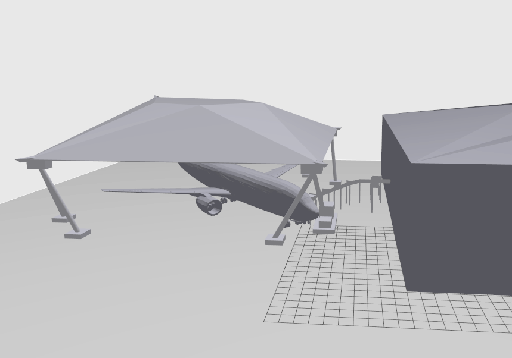
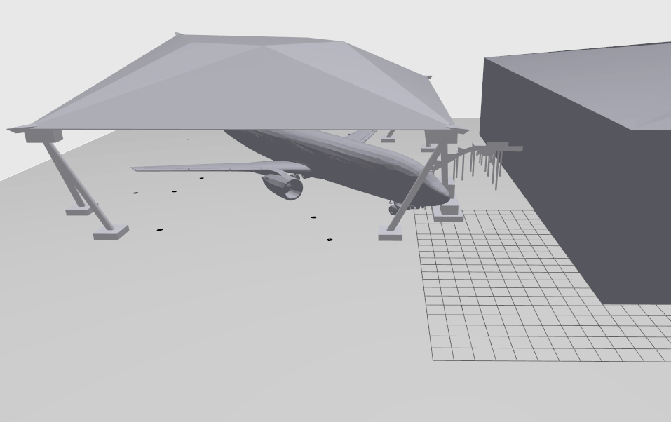

# DARTeC World Files

### This workspcae contains the world files used for the simulation. These world files are created by editing the world files provided by Mr. Angelos. Which is the scaled model of the DARTeC enviornemnt.

 

# There are 3 Different world files
 

## 1. dartec_wrold_1 (Default world which is the scaled replica of the DARTeC enviornment)

    

 

## 2. dartec_wrold_2 (Default world with waypoints added to the inspection points)

    

 

## 3. dartec_wrold_2 (Default world with waypoints and the static obstacles added to random locations in the world)

    

